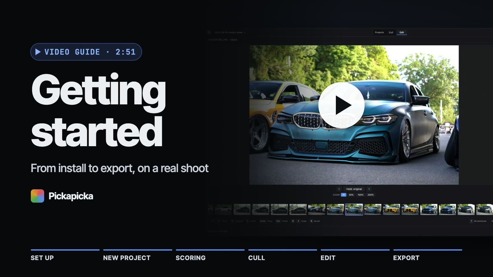
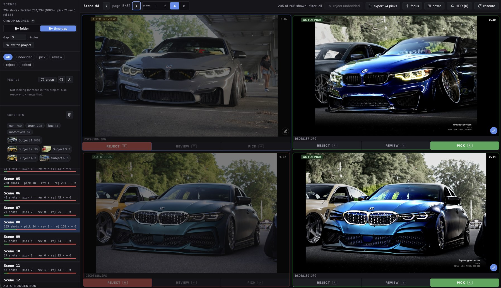
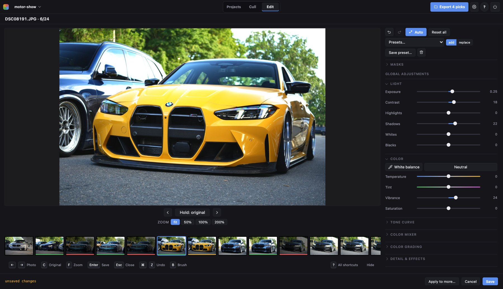

# Pickapicka

Cull and edit a shoot on your own machine. Scores every frame for sharpness and
exposure, groups them into scenes, suggests what to keep — then gives you a
non-destructive editor for the ones you do.

Built for post-shoot triage on a few hundred to a few thousand frames. Runs
entirely locally; nothing is uploaded.

Called Picture Classifier up to 0.9.0; [upgrading from it](docs/install.md#upgrading-from-picture-classifier).


https://github.com/user-attachments/assets/0e347ade-1275-46f8-acc5-1e2b6cb20fc5


[](https://youtu.be/y_Lt25yDufM)



Decide with one key per frame, filter by decision, and let the per-scene
suggestion do the first pass. Subject detection puts the frames that missed the
car at the bottom, and measures sharpness on the car rather than on the whole
frame.



Exposure through to a tone curve, local adjustments on radial, gradient and
brush masks, crop and straighten, film emulation, watermarks — all
non-destructive, and all previewed at the resolution you will export at.

## Install

Prebuilt installers for **macOS** (Apple Silicon) and **Windows** (x64) are on
the [Releases page](https://github.com/son-engr-kr/pickapicka/releases)
— download, run, launch. Both are unsigned, so the first launch needs
right-click → Open on macOS, or More info → Run anyway on Windows.

With [uv](https://github.com/astral-sh/uv), on any platform including Linux:

```bash
uv tool install git+https://github.com/son-engr-kr/pickapicka
pickapicka serve
```

Homebrew, from source, and the CLI are in [docs/install.md](docs/install.md).

## First run

`pickapicka serve` opens a landing page. The first time, it asks where to keep your
projects, a workspace folder kept apart from your photos, and offers a default.
Then create a project by name, point it at your photos (the wizard says how many
it found there), and say what the shoot is *of* if it has a subject. Scoring
runs once; after that the project opens where you left it.

Your photos are never moved or modified. Everything the app decides lives in the
project's own folder, in a `picks.json` that points at them.

Launched as an app, it opens with a short intro and a chime; Preferences turns
the sound off.

## What it does

**One window, three places**: a bar across the top names the project (click it
to switch to another) and has three tabs, **Projects**, **Cull** and **Edit**,
with what is running in the background, Export, Preferences and help beside
them.

**Culling** — per-frame blur and exposure scores, per-scene pick/review/reject
suggestions, scenes by folder or by EXIF time gap, one-key decisions, focus
peaking that measures edge steepness rather than contrast, a loupe, HDR bracket
auto-merge, and subject and face grouping.
→ [docs/culling.md](docs/culling.md)

**Editing** — the full slider set plus a tone curve, up to 16 local masks,
crop and straighten, defocus and motion and bloom and mosaic, film emulation
built as a chain rather than a filter, watermarks from EXIF templates, presets
that stack.
→ [docs/editing.md](docs/editing.md)

**Projects** — workspaces holding projects by name, three folder layouts, RAW
treated as first-class, re-link when a folder moves, and delete that renames
rather than deletes.
→ [docs/projects.md](docs/projects.md)

## Keyboard

`P` pick · `R` reject · `V` review · `U` clear (each decides the highlighted
photo and moves to the next) · `1`–`5` stars, `0` none · `6`–`9` colour
labels · `←` `→` move · `[` `]` a screen on or back · `Enter` viewer ·
`C` compare · `E` edit · `I` photo info · `X` select · `D` download the
selection · `B` subject boxes · `K` focus peaking · `L` loupe · `?` every
shortcut · `⌘,` / `Ctrl+,` preferences

In the editor: `R` `G` `B` add a radial, gradient or brush mask · `\` show the
mask · `Del` remove it · `C` hold the original · `F` fit ↔ 100% ·
`⌘Z` / `Ctrl+Z` undo · `⇧⌘Z` / `Ctrl+Y` redo

A bar along the bottom of the culling screen, the viewer and the editor shows
the keys for where you are, and `?` opens the full list, by screen. Hovering any
button shows what it does and its shortcut. The first time you open a project,
and the first time you open the editor, a guided tour walks through the
screen; the shortcut list replays it.

## Built on

numpy, OpenCV and Pillow for the pipeline; `onnxruntime` with YOLOX-tiny
(Apache-2.0) for subject detection; `insightface` for faces; scikit-learn for
the grouping; FastAPI and vanilla JS for the interface; rawpy for RAW.

No PyTorch, no framework in the browser, no network.

## Docs

- [Install and run](docs/install.md) — every install route, the CLI
- [Culling](docs/culling.md) — scoring, scenes, subjects, people
- [Editing](docs/editing.md) — the pipeline and every stage in it
- [Projects and files](docs/projects.md) — layouts, RAW, persistence
- [Development](docs/development.md) — tests, releasing

## License

MIT — see [LICENSE](LICENSE).
